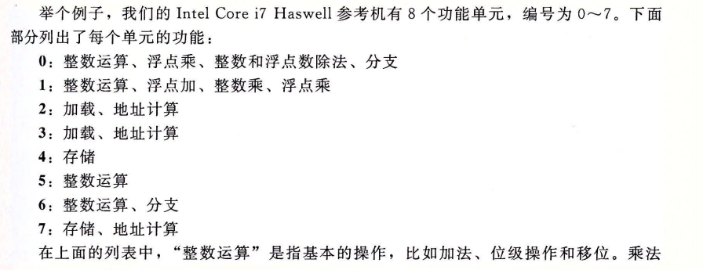
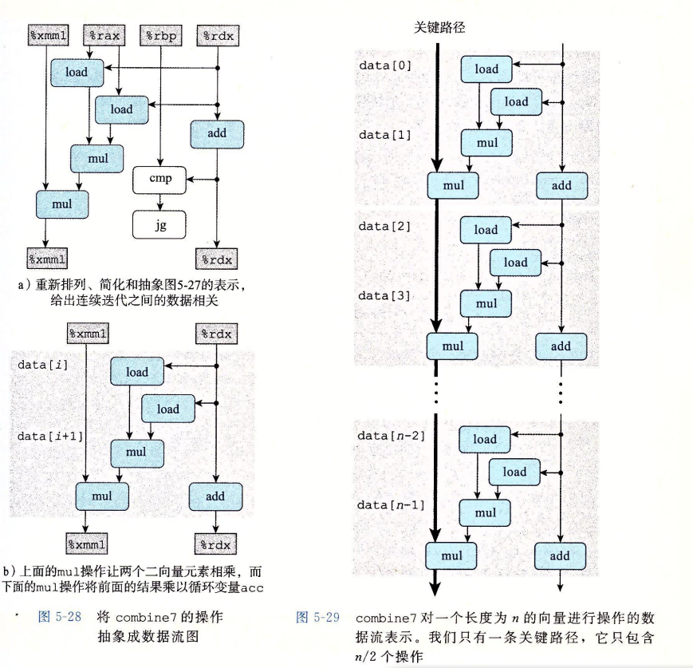
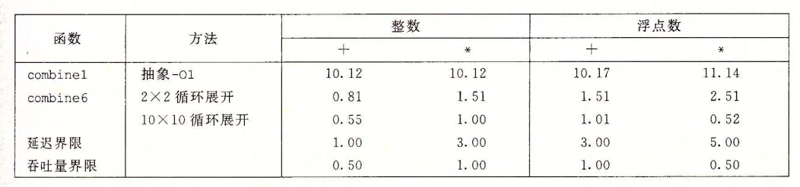

# 第五章 优化程序性能

主要探讨内容：如何使用几种不同类型的程序优化技术，使程序运行的更快


编写高效程序的几种方式：

1. 选择一种适当的算法和数据结构；

2. 编写出编译器能够有效优化以转换成高效可执行代码的源代码;

   ① 不依赖机型底层的优化  （5.1-5.6）

   ② 依赖指定机型处理器微体系结构的优化 （5.7-5.9）

3. 针对处理量大的计算，采用并行计算（12章）或者异构并行计算。


本章内容：如何编写出**编译器**能**够有效优化**以**转换成高效可执行代码**的源代码。


## 5.1、编译优化器的能力和局限性

理想：编译器能够接受我们编写的任何代码，并产生尽可能高效的、具有指定行为的机器级程序。

现实：现代编译器采用了复杂的分析和优化形式，而且变得越来越好。然而，即使最好的编译器也受到**妨碍优化的因素**（optimization blocker）的阻碍。


编写程序方式中看上去只是一点小小的变动，都会引起编译器优化方式很大的变化，所以一定要先理解编译优化器的能力和局限性有哪些。

### 5.1.1 编译优化器的能力

对于C/C++程序，大多数的编译器会指定优化级别，以GCC为例子：gcc -o指令就可以设置优化级别：

  -o0:关闭所有优化

  -o1:最基本的优化级别，编译器试图以较少的时间生成更快以及体积更小的代码。

（后续代码示例使用-o1编译，目的是为了展示 C语言函数的不同方法如何影响编译器产生代码的效率，使得让-o1写出的C代码能够比更高级别优化选项编译的性能还要好）

  -o2:推荐的优化级别，o1的进阶。 （目前被普遍接受）

  -o3:较危险的优化等级，这个等级会延长编译时间，编译后会产生更大的二进制文件，会带来一些无法预知的问题。

  -os:优化代码体积，通常适用于磁盘空间紧张或者CPU缓存较小的机器。

### 5.1.2 编译优化器的局限性

编译器对程序只使用***安全的优化***：对于程序可能遇到的所有可能情况，优化后的程序和未优化的版本有一样的行为。

在***安全的优化***中，主要有两个因素妨碍了优化

1. ***内存别名使用***
2. ***函数调用***

#### 5.1.2.1内存别名使用

举个“栗子”：

哪个函数的效率更高？为什么？

将存储在由指针 yp指示的位置处的值两次加到指针xp指示的位置处的值

```c
void twiddle1(long *xp, long *yp)
{
	*xp += *yp;
	*xp += *yp;
}

void twiddle2(long *xp, long *yp)
{
	*xp += 2 * *yp;
}
```

函数twiddle2效率更高一些。它只要求3次内存引用，而twiddle1需要6次(2次读*xp，2次读*yp，2次写*xp)。因此，如果要编译器编译过程twiddle1，我们会认为基于twiddle2执行的计算能产生更有效的代码。

不过，考虑xp等于yp的情况。此时，函数twiddle1会执行如下操作

```c
*xp += *xp;
*xp += *xp;
```

结果就是*xp的值变为原来的4倍

而twiddle2会执行如下操作

```
*xp += 2* *xp;
```

结果却是*xp的值变为原来的3倍

所以编译器不会产生 Twiddle2 的代码作为 Twiddle1 的优化代码.

两个指针可能存在指向同一个内存位置的情况称为***内存别名使用***，在执行安全的优化时，编译器会假设不同的指针指向内存的同一个位置。

#### 5.1.2.2函数调用

举个“栗子”：

func1和func2的行为是否相同？哪个效率更高？为什么？

```c
long f()；

long func1(){
	return f() + f() +f() +f();
}

long func2(){
	return 4 * f();
}
```

 可以看出f1调用了f()四次，而f2()只调用了一次，函数的调用涉及到栈帧的操作这需要消耗一些系统资源，因此按理来说f2()的性能优于f1()，但是编译器针对这种情况同样不会进行优化，考虑到以下代码

```c
long counter = 0 ;

long f(){
	return counter++;
}
```

f()函数有一个***副作用***——它修改了全局程序状态的一部分，改变调用它的次数会改变程序的行为

大多数的编译器不会去判断一个函数是否没有副作用，编译器会假设最糟糕的情况，并保持所有的函数调用不变。

**优化方式：**内联函数替换

对于 Func1() 我们可以用内联函数进行优化即将函数调用替换为函数体:

```c
//优化后的版本
int Funct1Inline()
{
    int t = counter++;    // +0
    t += counter++;        // +1
    t += counter++;        // +2
    t += counter++;        // +3
    return t;
}
```

这样的转换不仅可以减少了函数调用的开销, 也允许编译器对代码进行进一步优化:

```c
//编译器进一步优化
int Func1Opt()
{
    int t = 4 * counter + 6;
    counter += 4;
    return t;
}
```

### 5.1.3 GCC

GCC的优化能力并不突出，它能完成基本你的优化，但是它不会对程序进行更加“有进取心的”编译器所做的那种激进变化。因此，使用GCC的程序员必须花费更多的精力，以一种简化编译器生产高效代码的任务来编写程序。


## 5.2 表示程序的性能 CPE 

我们引入CPE作为一种表示程序性能并指导我们改进代码的方法。

***CPE***：cycles per element , ***每元素的周期数***。

```c
/* Compute prefix sum of vector a */
void psum1(float a[], float p[], long n){
	long i; 
	p[0] = a[0];
	for (i = i; i < n; i++){
		p[i] = p[i-1] + a[i];
	}
}

void psum2(float a[], float p[], long n){ //循环展开技术
	long i; 
	p[0] = a[0];
	for (i = 1; i < n-1; i+=2){
		float mid_val = p[i-1] + a[i];
		p[i] = mid_val;
		p[i+1] = mid_val + a[i+1];
	}
    /*For even n,finish remaining element */
	if (i < n)
		p[i] = p[i-1] + a[i];
}
```


运行时间  （单位：时钟周期  比如 4GHz处理器 ，运行频率为每秒4*10^9个周期 ，一个时钟周期为0.25纳秒） 

psum1：368 + 9.0n

psum2：368 + 6.0n


对于较大的n，函数的运行时间就会主要由线性因子决定，即每个元素的周期数（Cycles Per Element，CPE）


## 5.3 程序示例

```c
// 这里使用宏不是故弄玄虚，是为了便于测试加法和乘法对比，后续的效率对比都会对比两种操作
typrdef struct {
	long len;
	data_t *data;
}vec_rec, *vec_ptr;

int vec_length(vec_ptr v) {
    return v->len;
}
int get_vec_element(vec_ptr v, long index, data_t *dest) {
    if (index < 0 || index >= v->len)
        return 0;
    *dest = v->data[index];
    return 1;
}

vec_ptr new_vec(long len){
   ```malloc`````
}

#define IDENT 0 // 1
#define OPER +  // *

void combin1(vec_ptr v, data_t *dest) {
    int i;
    *dest = IDENT;
    for (i = 0; i < vec_length(v); i++) {
        data_t val;
        get_vec_element(v, i, &val);
        *dest = *dest OPER val;
    }
}
````````


## 5.4 消除循环的低效率

观察到上面代码循环条件调用`vec_length`，实际上该列表在循环中并不会改变长度，所以将这个函数的返回值作为临时变量，减少函数调用。

```c
void combine2(vec_ptr v, data_t *dest) {
    int i;
    *dest = IDENT;
    int len = vec_length(v);
    for (i = 0; i < len; i++) {
        data_t val;
        get_vec_element(v, i, &val);
        *dest = *dest OPER val;
    }
}
```

这是一类常见的、被称为***代码移动***的优化方法。编译器通常会非常小心，它们无法可靠的知道一个函数挪动位置是否有副作用。所以这种优化只能由程序员来处理。通过上述的改动，得到程序的运行时间的改变对比


所谓循环低效率，就是说循环里面做了一些不必的事，效率自然低了。道理很简单，减少不必要的调用。
我认为任何优化都是在两个方向上出力，一个是操作数量，一个是单个操作的时间。可以简单的认为 消耗时间 = 单个时间 * 操作数量。
什么叫`渐进效率`：即随着循环次数的增加，指数级的增加运行时间。书中举了个在循环判断中使用strlen函数的例子，随着字符串长度的增加，循环的耗时急剧增长。应当注意避免，少在循环条件中使用一些耗时的函数。

## 5.5 减少过程调用

减少过程调用即减少***函数调用***。例如上面combine1函数循环中会调用的get_vec_element函数，而这个函数实际上是很容易优化掉的。例如，我们使用指针的思路来改造为：

```c
data_t *get_vec_start(vec_ptr v) {
    return v->data;
}
void conbine3(vec_ptr v, data_t *dest) {
    long i;
    long length = vec_length(v);
    data_t *data = get_vec_start(v);
    *dest = IDENT;
    for (i = 0; i < length; i++) {
        *dest = *dest OP data[i];
    }
}
```

看起来代码简洁简单了许多，然而令人遗憾的是，性能基本没有发生变化：


但是应该注意，不是说这个优化方法、方向不对，而是对于这个函数，`get_vec_element`不是函数的瓶颈，有其他部分的性能限制了它的性能界限。

可能有人奇怪，就算其他地方有性能限制，这里说到底也是减少了函数调用和判断的操作，怎么性能就没有任何变化，完全说不通啊。

不要着急，优化到了这里，仿佛已经开始往奇诡的方向发展，但是要相信科学，马上我们就能打开不一样的世界

## 5.6 消除不必要的存储器引用

通过查看`combine3`的汇编代码：


可以看到`(%rbx)`是表示dest，在2、3、4行中，被反复的读取和写入内存。

内存的读写比寄存器要慢不少，消除这种内存的读写，可以提高上面函数的循环效率。

怎么消除？我们知道临时变量在寄存器够用的情况下都是在寄存器中的，这里可以通过一个临时变量来实现：

```c
void combine4(vec_ptr v, data_t *dest) {
    long i;
    long length = vec_length(v);
    data_t *data = get_vec_start(v);
    data_t add = IDENT;
    for (i = 0; i < length; i++) {
        acc = acc OP data[i];    // 通过局部变量来累加
    }
    *dest = acc;   // 最终才赋值给dest
}
```


对比CPE，可以看到停滞不前的CPE终于又有了动静。


可能有人会觉得好的编译器应该能自己做到使用临时变量来优化。但是对于这个函数，由于可能存在的内存别名的问题，编译器没法这么优化，例如dest如果是v列表中的某一项的地址呢？结果其实就会完全不一样了。只有程序员知道是否会出现这个情况。


现在我们还有两个问题：第一，为什么上一步减少`get_vec_element`的优化，看起来没有作用。第二，`combine4`是否还有进一步优化的空间？

且听下回分解。

---------------------------------——————————————————————————————--————

上一次讲到，现在我们还有两个问题，第一，为什么上一步减少`get_vec_element`的优化，看起来没有作用。第二，`combine4`是否还有进一步优化的空间。

要回答这两个问题，我们需要先稍微了解一下现代处理器的一些内部操作流程。


前面都是些基本的优化操作：

- 降低循环的低效率
- 减少函数调用
- 消除存储器引用，使用临时变量前面都是些基本的优化操作：

这几个方法都是处理器无关的，不依赖任何机器特性。接下来，就要利用处理器的一些处理方式来有正对性的优化了。

## 5.7 理解现代处理器 *

从汇编级来看，指令都是一条条执行，每条指令都包括从寄存器或者存储器取值，执行一个操作，并把结果放回寄存器或者存储器。但在实际的处理器中，是同时对多条指令求值的，这个现象称为`指令级并行`，在某些设计中，可以有100或更多的指令在处理中。当然，处理器会有很多精细的机制来保证，指令看起来是简单的顺序执行的。

### 5.7.1 整体操作

下图是基于近期Intel处理器的一个近似结构，它的一个特性叫做**超标量**，

- **超标量**：处理器可以在每个时钟周期执行多个操作，而且是**乱序**的——指令执行的顺序不一定要与它们在机器级程序中的顺序一致。

- 这种处理器有两个主要部分：

  **指令控制单元**：（ICU——Instuction Control Unit）：负责从内存中读出指令序列，并根据这些指令序列生成一组针对程序数据的基本操作。

  **执行单元**（EU——Execution Unit）：执行操作。


- ICU从**指令高速缓存**中读取指令进行**指令译码**，此时可能会遇到**指令分支**，现代处理器使用**分支预测**技术，猜测是否会执行分支并预测分支的目标地址。

- **退役单元**记录正在进行的处理，指令译码时，关于指令的信息被放置在一个**队列**中，当该指令的操作完成并且分支预测结果正确，该指令就可以**退役**了，退役单元中的**寄存器文件**的更新也会被执行。

  如果分支预测错误，那么这条指令会被清空，丢弃所有计算出来的结果，取值控制会选取另一个方向上的指令。

- **读写内存**是由加载和存储单元实现的，通过**数据高速缓存**来访问内存。

- **操作结果**负责执行单元中各个单元间的**数据交互**。

  

分支预测：

处理器在遇到分支跳转的时候，会采用一种`分支预测`的技术，用来投机提前执行一些操作。预测就有可能错误，当预测错误的时候，提前执行的东西就浪费了，需要重新取出另一个方向上的指令。


### 5.7.2 功能单元的性能

下标是Intel Core i7参考机的一些算术性能。

**延迟**：表示完成运算所需要的总时间

**发射时间**：脸次运算之间间隔的最小周期数

**容量**：表示同时发射多少个这样的操作（运算的功能单元的数量，同时处理多个相同操作的基础）


加法和乘法的发射时间都是1，这是通过流水线来实现的。当个操作没有结束就可以开始新的阶段操作。

**除法运算时没有流水线实现的，它的发射时间等于延迟，说明新的运算需要等上一个运算结束后才开始。所以除法很慢。**

功能单元的最大吞吐量为发射时间的倒数。容量可以增加吞吐量，例如容量为C，发射时间为I ，则吞吐量为 `C / I` 。而下文提到的**吞吐量界限则**是吞吐量的CPE表示，即吞吐量的倒数。

例如吞吐量为2，表示每个时钟周期能执行两个操作，即相应的CPE为0.5 。


**问题：**

**为什么整数+的吞吐量是0.5 不应该是 1/4=0.25？**


### 5.7.3 处理器操作的抽象模型

前面combine4函数目前为止是最快的，这里对比下该函数与理论值的比较：可以看到距离理论值还有一定的距离。


现象：除了整数加法，其他测量值与处理器的延迟的延迟界限一样

原因：表妹这些函数的性能是由所执行的求和或者乘积计算主宰

计算N个元素乘积或者和需要大约L×n+K个始终周期， 其中，L——合并运算的延迟;K——调用函数和初始化以及终止循环的开销; 

##### **1.  从机器级代码到数据流图——关键路径**

```c
void combine4(vec_ptr v, data_t *dest) {
    long i;
    long length = vec_length(v);
    data_t *data = get_vec_start(v);
    data_t add = IDENT;
    for (i = 0; i < length; i++) {
        acc = acc OP data[i];    // 通过局部变量来累加 OP = * vec_ptr v 是单精度浮点数
    }
    *dest = acc;   // 最终才赋值给dest
}
```


顶部方框：循环开始时候寄存器的值

底部方框：最后寄存器的值


对于形成循环的代码片段，我们可以将访问到的寄存器分为四类

只读：只作源值，不被修改

只写：作为数据传送操作的目的

局部：在循环内部被修改和使用，迭代与迭代之间不相关

循环：既作为源值，又作为目的，一次迭代产生的值会在另一次迭代中用到


**问题：**

**循环程序的性能和什么寄存器的联系更强，为什么？**


为了更清晰展示从顶部源寄存器到底部目的寄存器的数据流，将数据流图重排


假设：

指令控制单元预测会选择分支，因此程序会继续循环，比较和分支操作的目的是测试分支条件，如果不选择分支的话，就通知ICU。我们假设这个检查能够完成得足够快，不会减慢处理器的执行。


简化：

消除a)标识符为白色的操作符，只保留循环寄存器，得到抽象模板，用于表明循环的一次迭代在循环寄存器中形成的数据相关。


整个循环流程图：两条数据相关链条


浮点乘法的延迟周期为5个周期，而整数加法的延迟为1个周期，因此对于combine4，当执行这个函数时，浮点乘法器成为了制约资源，左边的数据相关链成为了**制约程序性能的关键路径**。

循环中其他操作（add,内存中读取数据）与乘法并行执行了，每次后继的acc的值被计算出来，


**对于整数加法：combine4的测试表明CPE为1.27，而不是关键路径预测的1.00，为什么？**


**2.  其他因素**

数据流的关键路径提供的只是程序需要的周期数的下界，还有其他一些因素会限制性能，**包括可用的功能单元的数量**和**任何一步中功能单元之间能够传递数据的数量**。

对于合并运算为整数加法的情况，数据操作足够快，其他操作供应数据的速度不够快， 要准确确定为什么是1.27个周期，需要非公开的硬件设计知识。


## 5.8 循环展开 *

通过**增加每次迭代**计算元素的**数量**，**减少循环**的迭代**次数**。

**改进程序性能的原因：**

1. **减少了不直接有助于程序结果的操作数量**，列入循环索引计算和条件分支
2. 提供了一些方法，可以进一步变化代码，**减少整个计算中关键路径上的操作数量**。


使用“2X1”循环展开之前的代码：

- 第一个循环每次处理数组的两个元素
- 第二个循环处理最后几个元素（剩余元素向量长度不为2的倍数），每次处理一个元素

```c
// 对combine4做2*1的循环展开
void combine5(ver_ptr v, data_t *dest) {
    ...
    long limit = length - 1;
    for (i = 0; i < limit; i+=2) {
        acc = (acc OP data[i]) OP data[i+1];   // 一次循环实际计算了两个元素
    } 
    for (; i < length; i++) {
        acc = acc OP data[i];
    }
}
```


对于整数加法，CPE有所改进，得到的延迟界限为1.00,这得益于先少了循环的开销。


**对程序进行K×1 的循环展开，会有什么效果？**


对于展开次数k，上限limit应当设置为`length - k + 1` ，并且后续需要增加循环 `for(; i < length; i++)`来处理尾部剩下的数值。


**问题：**

**为什么K×1 的循环展开，循环展开没有继续提升性能，程序的性能并没有低于延迟界限？**


```c
// 对combine4做2*1的循环展开
void combine5(ver_ptr v, data_t *dest) {
    ...
    long limit = length - 1;
    for (i = 0; i < limit; i+=2) {
        acc = (acc OP data[i]) OP data[i+1];   // 一次循环实际计算了两个元素
    } 
    for (; i < length; i++) {
        acc = acc OP data[i];
    }
}

//combine5的第一个for循环汇编代码 其中 data_t = double ,OP = *
//i in %rdx ,data %rax ,limit in %rbp ,acc in %xmm0
1 .L35                                 //loop:
2 vmulsd (%rax,%rdx,8),%xmm0,%xmmm0)  //Multipy acc by data[i]
3 vmulsd 8(%rax,%rdx,8),%xmm0,%xmmm0) //Multipy acc by data[i+i]
4 addq $2, %rdx						  //Increment i by 2
5 cxmpq %rdx,%rbp					  //Compare to limit:i
6 jg .L35							 //If > , goto loop
```


## 5.9 提高并行性 *

加法和乘法是完全流水线化的，这说明每个时钟周期都可以开始一个新的操作，即使前面的计算没有完成。而前面的循环展开没法使用这种能力，是因为每次计算的结果在同一个变量当中，下次循环需要等待上次的结果。基于这个情况就引出了新的优化方法：**使用多个累积变量**

### 5.9.1 使用多个累积变量

简单来说就是，将前面函数的acc拆成两个变量，各算各的，最终再汇总。上代码。

```c
void combine6(vec_ptr v, data_t *dest) {
    long i;
    long limit = length - 1;
    long length = vec_length(v);
    data_t *data = get_vec_start(v);
    data_t acc0 = IDENT;
    data_t acc1 = IDENT;
    for (i = 0; i < limit; i+=2) {
        acc0 = acc0 OP data[i];   // 分别计算各自的内容
        acc1 = acc1 OP data[i+1];
    }
    for (; i < length; ++i) {
        acc0 = acc0 OP data[i];
    }
    *dest = acc0 OP acc1;
}
```

combine6的性能突破了延迟界限！除了整数加法，其他操作提高了2倍！


之前计算吞吐量界限的时候，它的计算是，延迟 / 模块的容量，这意味着，必须要并行的使用多个计算模块，才有可能逼近吞吐量界限。现在已经突破延迟，说明并行已经起作用了。

再来看2*2展开的操作图，对比之前的图，可以看出来，第二个load和mul都不需要等待前面的操作结束，直接开启了新的流水线。


我们可以将多个累计变量变化归纳为循环展开K次，以及并行积累K个，以及并行积累K个值，得到K×K循环展开。当K足够大时，程序在所有情况下几乎都能达到吞吐量界限


当某类计算的相关所有功能单元的流水线都是满的时候，程序就能接近达到吞吐量的界限。对于延迟为L，容量为C的操作来说，循环展开因子`k >= C * L`时可以达到最大性能。例如浮点乘法 C为2，L为5，则展开因子`k>=10` 。浮点加法C为1， L为3，则k>=3时获得最大性能。


### 5.9.2 重新结合变换

另一种打破延迟极限的方法，更加的让人匪夷所思，对combine5稍作修改如下：

```c
// 对combine5做2*1a的循环展开
void combine5(ver_ptr v, data_t *dest) {
    ...
    long limit = length - 1;
    for (i = 0; i < limit; i+=2) {
        //acc = (acc OP data[i]) OP data[i+1];  //combin5
        acc = acc OP (data[i] OP data[i+1]);   // 一次循环实际计算了两个元素
    }
    for (; i < length; i++) {
        acc = acc OP data[i];
    }
}
```


这个改动在浮点数上，已经跟combine6使用多个累积变量效果一致了。这是为什么呢？




### * SIMD 单指令多数据

SIMD可以使用一条指令对整个向量的数据进行操作，目前AVX的寄存器长为32字节，256位，即可以对8个32数或者4个64位数并行操作。该方法也能极大的提高一些频繁操作的数据的效率。


## 5.10 优化合并代码的结果小结



以整数加法为例，从10.12的CPE，到0.55的CPE，基本逼近0.5的理论极限。几乎提升了20倍，如果使用SIMD重写，可以再获得4到8倍的提升，例如浮点数乘法的CPE能够降到惊人的0.06 。

## 5.11 一些限制因素 *

### 5.11.1 寄存器溢出

循环展开也不是可以随意数量的无限展开的，例如寄存器数量只有16个，展开数量超过16个肯定是寄存器溢出的，溢出就只能存到栈上，可能反而会降低效率。

### 5.11.2 分支预测和预测错误处罚

前面提到过，处理器在遇到分支的时候，会直接投机的提前执行其中一个分支。这种预测如果错误，就需要丢弃掉所有的执行结果，从正确的位置重新开始取指令过程，错误处罚也就是这个地方引起的，因为指令流水线需要重新填充。

新的x86处理器增加了`条件传送指令`，可以用于减少分支预测。例如`int a = b ? c : d;` 将可能使用条件传送指令而不是跳转指令。

对于程序员而言，没什么简单的方法避免分支预测，但可以遵循下面两个原则：

1. 不要过分关心可预测的分支 处理器有很多有经验的预测方法，在一些规律模式上有很好的预测成功率
2. 书写适合用条件传送实现的代码 例如前面的 ? : 代码就能够直接翻译为选择传送。

## 5.12 理解内存性能*

注意，本节中的内存性能只考虑数据都放在高速缓存的情况。

第6章会深入研究高速缓存是如何工作的，以及如何编写充分利用高速缓存的代码。


## 5.13 应用：性能提高技术

优化程序的基本策略：

1. 高级设计：选择适当的算法和数据结构，避免指数级增加消耗的算法和编码技术

2. 基本编码原则：

   消除连续的函数调用。将可以移出循环的函数或者计算移出来

   消除不必要的内存引用。加载内存和写入内存都有消耗，使用中间变量来减少内存的访问

3. 低级优化

   循环展开，降低循环开销

   使用多个累积变量的方法，利用处理器指令并行处理能力

   使用功能性风格重写条件判断，减少判断，便于编译采用条件传送功能。

需要注意，优化代码不应该改变代码本身的逻辑，同样的输入应当产生同样的输出。

## 5.14 确认和消除性能瓶颈

介绍一个工具，用于分析时间

```C
//test_gprof.c
#include<stdio.h>


void new_func1(void)
{
    printf("\n Inside new_func1()\n");
    int i = 0;

    for(;i<0xffffffee;i++);

    return;
}

void func1(void)
{
    printf("\n Inside func1 \n");
    int i = 0;

    for(;i<0xffffffff;i++);
    new_func1();

    return;
}

static void func2(void)
{
    printf("\n Inside func2 \n");
    int i = 0;

    for(;i<0xffffffaa;i++);
    return;
}

int main(void)
{
    printf("\n Inside main()\n");
    int i = 0;

    for(;i<0xffffff;i++);
    func1();
    func2();

    return 0;
}
```


## 5.15 小结