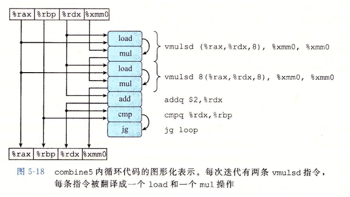

**问题：**

**为什么整数+的吞吐量是0.5 不应该是 1/4=0.25？**

只用两个功能单元用来加载数据（造成了另外的吞吐量界限），从而限制了乘加单元的速度


**问题：**

**循环程序的性能和什么寄存器的联系更强，为什么？**

循环寄存器，循环寄存器的之间的操作链决定了数据流的关键路径


**问题：**

**为什么K×1 的循环展开，循环展开没有继续提升性能，程序的性能并没有低于延迟界限？**

```c
// 对combine4做2*1的循环展开
void combine5(ver_ptr v, data_t *dest) {
    ...
    long limit = length - 1;
    for (i = 0; i < limit; i+=2) {
        acc = (acc OP data[i]) OP data[i+1];   // 一次循环实际计算了两个元素
    } 
    for (; i < length; i++) {
        acc = acc OP data[i];
    }
}

//combine5的for循环汇编代码 其中 data_t = double ,OP = *
//i in %rdx ,data %rax ,limit in %rbp ,acc in %xmm0
1 .L35                                //loop:
2 vmulsd (%rax,%rdx,8),%xmm0,%xmm0)   //Multipy acc by data[i]
3 vmulsd 8(%rax,%rdx,8),%xmm0,%xmm0)  //Multipy acc by data[i+i]
4 addq $2, %rdx						  //Increment i by 2
5 cxmpq %rdx,%rbp					  //Compare to limit:i
6 jg .L35							  //If > , goto loop
```



